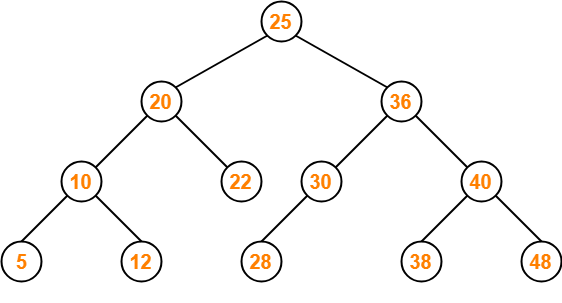

# 이진트리와 이진탐색트리

## 이진트리(BT, Binary Tree)

**각각의 노드의 자식노드 수가 2개 이하로 구성되어있는 트리**를 의미하며 이를 다음과 같이 분류한다. 

### 이진트리 종류 (암기!)

_트리의 종류_

- 정이진 트리(full binary tree) : 자식 노드가 0 또는 2개인 이진 트리를 의미한다.
- 완전 이진 트리(complete binary tree) : 왼쪽에서부터 채워져 있는 이진 트리를 의미한다. 마지막 레벨을 제외하고는 모든 레벨이 완전히 채워져 있으며 마지막 레벨의 경우 왼쪽부터 채워져 있다.
- 변질 이진 트리(degenerate binary tree) : 자식 노드가 하나밖에 없는 이진 트리를 의미한다.
- 포화 이진 트리(perfect binary tree) : 모든 노드가 꽉 차 있는 이진 트리를 의미한다.
- ⭐️균형 이진 트리(balanced binary tree) : **모든 노드의 왼쪽 하위 트리와 오른쪽 하위 트리의 차이가 1 이하인 트리**이다. map, set을 구성하는 레드 블랙 트리는 균형 이진 트리 중 하나이다.

## 이진탐색트리(BST, Binary Search Tree)

이진트리의 일종으로 노드의 오른쪽 하위 트리에는 "노드의 값보다 큰 값"이 있는 노드만 포함되고 왼쪽 하위 트리에는 "노드의 값보다 작은 값"이 들어있는 트리를 말한다.

이 때 왼쪽 및 오른쪽 하위 트리는 해당 특성을 갖는다. **이렇게 두면 "검색"을 하기에 용이하다.** 왼쪽에는 작은 값, 오른쪽에는 큰 값이 이미 정해져있기 때문에 예를 들어 10을 찾으려고 한다면 25의 왼쪽 노드들만 찾으면 된다는 것은 자명하기 때문이다. **이렇게 한다면 전체탐색을 하지 않아도 된다.**

### 이진탐색트리의 시간복잡도

위의 그림과 같이 균형잡히게 분포가 되었다면 탐색, 삽입, 삭제, 수정 모두 O(logN)이다.

그러나 이는 삽입 순서에 따라 달라진다. 예를 들어 1, 2, 3 이렇게 삽입이 되어 이진탐색트리가 완성이 되었다면, 이렇게 "선형적"인 자료구조가 완성되어버린다. 
이때, 시간복잡도가 O(N)이 되버린다.
*(참고) 선형적은 직선, 비선형적은 직선이 아닌 모양을 의미한다.*

즉, 이진탐색트리는 삽입순서에 따라 영향을 받는다. 그러나 삽입순서가 어떻게 되든 트리의 노드들을 회전시키는 등의 방법을 통해서 **"균형잡히게 만든" 이진탐색트리에서 발전된 트리로는 AVL트리, 레드블랙트리**가 있다. 예를 들어 map이라는 자료구조는 삽입, 탐색, 삭제, 수정의 시간복잡도가 모두 O(logN)임을 보장받는데 그 이유가 균형잡힌 트리인 레드블랙트리를 기반으로 구현되어있기 때문이다.   

