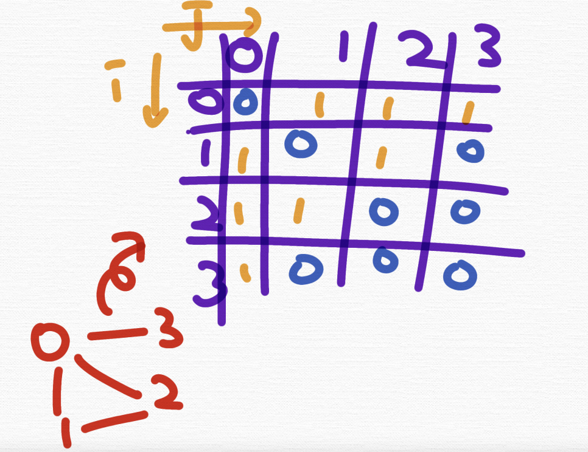

# 인접행렬과 인접리스트

컴퓨터에게 내가 이러한 그래프를 그렸다고 알려줄 표현방법으로는 인접행렬과 인접리스트가 있다. 

*(참고) 인접해있다 = 연결되어있다. 라고 보면 된다.*

## 인접행렬(adjacency matrix)

인접행렬이란 **그래프에서 정점과 간선의 관계를 나타내는  bool 타입의 정사각형 행렬을 의미한다.**

**정사각형 행렬의 각 요소가 0 또는 1이라는 값으로 가짐**을 의미하는데, **0은 두 정점 사이의 경로가 없음**을 의미하며 **1은 두 정점 사이의 경로가 있음**을 의미한다.   

*(참고) 무방향 그래프로 설명되어있는데 무방향 그래프 := 양방향 그래프*


위의 그림을 다음과 같은 행렬로 표현하는 것을 말한다. 

1 - 1, 2 - 2를 보면 0으로 되어있는 것을 볼 수 있는데 자기자신을 나타내는 것이며 해당 정점의 **사이클이 없을 때는 0, 사이클이 있을 때는 1**로 표기한다. 

0 - 1 이 연결되어있기 때문에 a[0][1] = 1이 된다. 그러나 1 - 3은 연결되어있지 않기 때문에 a[1][3] = 0이 된다.



이걸 코드로 표현하면 다음과 같다. 

```c++
bool a[4][4] = {
    {0, 1, 1, 1},
    {1, 0, 1, 0},
    {1, 1, 0, 0},
    {1, 0, 0, 0},
};
```

그렇다면 이를 기반으로 어떻게 코드를 구축할까? 

보통은 다음 코드처럼 2중 for문을 통해 i에서 j로 가는 경로가 있다면 어떠한 로직 또는 해당 정점으로 부터 탐색하는 로직을 구축한다. 

*(참고) bfs와 dfs는 하나의 예에 불과하다. 이것들 말고도 이 정점으로부터 탐색하는 다양한 알고리즘을 쓸 수 있다.*

```c++
bool a[V][V];
for(int i = 0;i < V; i++){
    for(int j = 0; j < V; j++){
        if(a[i][j]){
            //출력하는 로직
            cout << i << "부터 " << j << "까지 경로가 있습니다.\n";
            // 해당 정점으로 부터 탐색하는 로직
            bfs(i);
            dfs(i);
        }
    }
}
```

### 예시문제

Q. 3번노드에서 5번노드로 가는 단방향 경로가 있고 이를 인접행렬로 표현한다면? 

```c++
a[3][5] = 1;
```

Q. 3번노드에서 5번노드로 가는 양뱡향 경로가 있고 이를 인접행렬로 표현한다면? 

```c++
a[3][5] = 1;
a[5][3] = 1;
```

Q. 정점의 갯수가 20개인 그래프가 있다. 이를 인접행렬로 표현한다고 했을 때 메모리를 최소로 쓴다고 했을 때 배열을 어떻게 만들어야 할까? 

```c++
bool a[20][20];
​```

Q. 인접행렬을 기반으로 탐색하기​

1번. 
<br>
정점은 0번 부터 9번까지 10개의 노드가 있다. 1 - 2 /  1 - 3 / 3 - 4 라는 경로가 있다. (1번과 2번, 1번과 3번, 3번과 4번은 연결되어있다.) 

이를  이를 인접행렬로 표현한다면? 

2번. 
<br>
0번부터 방문안한 노드를 찾고 해당 노드부터 방문, 연결된 노드를 이어서 방문해서 출력하는 재귀함수를 만들고 싶다면 어떻게 해야할까? 또한, 정점을 방문하고 다시 방문하지 않게 만드려면 어떻게 해야할까? 


정답코드.
```c++
#include<bits/stdc++.h>
using namespace std; 
const int V = 10;
bool a[V][V], visited[V];
void go(int from){ 
	visited[from] = 1; 
	cout << from << '\n';
	for(int i = 0; i < V; i++){
		if(visited[i]) continue;
		if(a[from][i]){ 
			go(i);
		}
	}
	return;
}
int main(){
	a[1][2] = 1; a[1][3] = 1; a[3][4] = 1;
	a[2][1] = 1; a[3][1] = 1; a[4][3] = 1;
	for(int i = 0;i < V; i++){
		for(int j = 0; j < V; j++){
			if(a[i][j] && visited[i] == 0){
				go(i); 
			}
		}
	} 
} 
```