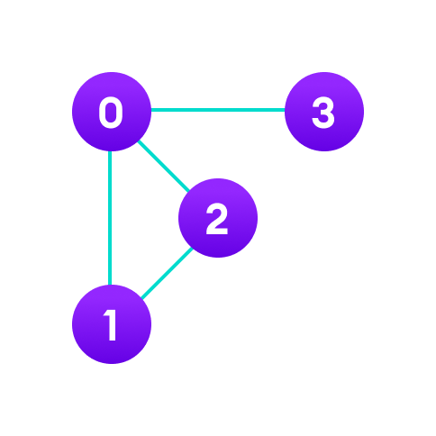
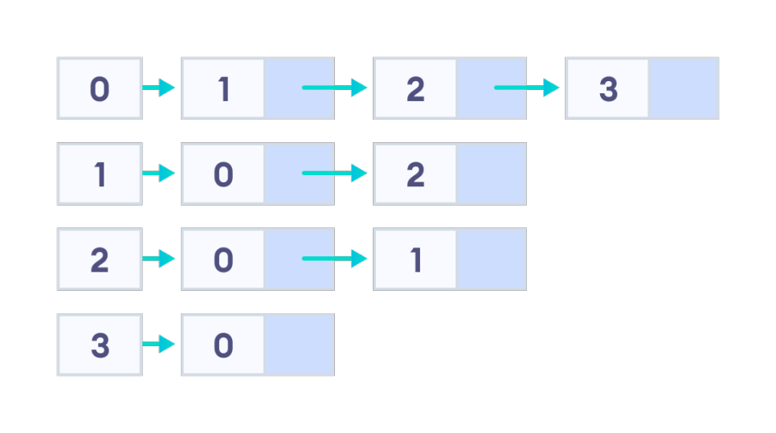

# 인접리스트(adjacency list)

인접 리스트는 **그래프에서 정점과 간선의 관계를 나타내는 연결리스트**를 의미한다.  



이 그래프를 아래와 같이 나타낼 수 있다.  



코드로 표현하면 다음과 같다.

```c++
#include<bits/stdc++.h>
using namespace std; 
const int V = 4;
vector<int> adj[V];
int main(){
    adj[0].push_back(1);
    adj[0].push_back(2);
    adj[0].push_back(3);

    adj[1].push_back(0);
    adj[1].push_back(2);

    adj[2].push_back(0);
    adj[2].push_back(1);

    adj[3].push_back(0); 

    for(int i = 0; i < 4; i++){
        cout << i << " :: ";
        for(int there : adj[i]){
            cout << there << " ";
        }
        cout << '\n'; 
    }
    // 이렇게도 할 수 있다.
    for(int i = 0; i < 4; i++){
        cout << i << " :: ";
        for(int j = 0; j < adj[i].size(); j++){
            cout << adj[i][j] << " ";
        } 
        cout << '\n'; 
    }
    
} 
/*
0 :: 1 2 3 
1 :: 0 2 
2 :: 0 1 
3 :: 0 
*/
```

Q. 왜 인접리스트가 아닌 vector도 될까?

인접리스트인 list로 구현해도 되고 vector로 구현해도 된다. 

```c++
// vector
vector<int> adj[1004];
// list
list<int> adj[1004];
```

이는 연결리스트와 vector의 연산 시간복잡도 차이를 보면 된다. 

> 연결리스트

- n번째 인덱스에 삽입, 삭제 : O(1)
- 마지막 요소에 삽입, 삭제 : O(1)
- 특정요소 탐색 : O(n)
- n번째 요소 참조 : O(n)

> vector

- n번째 인덱스에 삽입, 삭제 : O(n)
- 마지막 요소에 삽입, 삭제 : O(1)
- 특정요소 탐색 : O(n)
- n번째 요소 참조 : O(1)


인접리스트를 구현할 때 많이 사용되는 연산은 마지막 요소에 삽입과 해당 배열을 탐색하는 연산입이다. 

그렇기 때문에 vector로 구현해도 무방하다.
<br>
*(참고) vector가 편하기 때문에 vector로 구현하는 것을 추천*

## 예시문제

Q. 인접리스트를 기반으로 탐색하기

1번.
<br>
정점은 0번 부터 9번까지 10개의 노드가 있다. 1 - 2 /  1 - 3 / 3 - 4 라는 경로가 있다. (1번과 2번, 1번과 3번, 3번과 4번은 연결되어있다.) 
<br>
이를 인접리스트로 표현한다면? 

2번. 
<br>
0번부터 방문안한 노드를 찾고 해당 노드부터 방문, 연결된 노드를 이어서 방문해서 출력하는 재귀함수를 만들고 싶다면 어떻게 해야할까? 
<br>
또한, 정점을 방문하고 다시 방문하지 않게 만드려면 어떻게 해야할까? 

정답.

```c++
#include<bits/stdc++.h>
using namespace std; 
const int V = 10;
vector<int> adj[V];  
int visited[V];
void go(int idx){
    cout << idx << '\n';
    visited[idx] = 1;
    for(int there : adj[idx]){
        if(visited[there]) continue;
        go(there);
    } 
    return;
}
int main(){
    adj[1].push_back(2);
    adj[2].push_back(1);

    adj[1].push_back(3); 
    adj[3].push_back(1);

    adj[3].push_back(4); 
    adj[4].push_back(3); 
    for(int i = 0; i < V; i++){
        if(adj[i].size() && visited[i] == 0) go(i);
    } 
} 
/*
1
2
3
4
*/
```


​