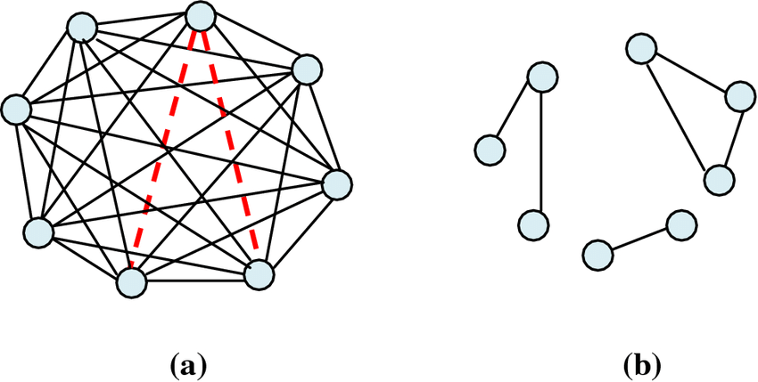

# 인접행령과 인접리스트의 차이 

둘 중에 어떤 것을 써야 할까? 일단 차이를 다음과 같다.

## 공간복잡도

- 인접행렬 : O(V^2)
- 인접리스트 : O(V + E)

```c++
// 인접행렬
bool adj[V][V];
// 인접리스트
vector<int> adj[V]; 
```

## 시간복잡도 : 간선 한개 찾기

- 인접행렬 : O(1)
- 인접리스트 : O(V) 

```c++
// 인접행렬
for(int i = 0;i < V; i++){
    for(int j = 0; j < V; j++){
        if(a[i][j]){ 
        }
    }
}
// 인접리스트
for(int j = 0; j < adj[i].size(); j++){
    cout << adj[i][j] << " ";
} 
```

## 시간복잡도 : 모든 간선찾기

- 인접행렬 : O(V^2)
- 인접리스트 :  O(V + E)  
​

## 그래프가 희소할 때는 인접리스트, 조밀 할 때는 인접행렬이 좋다. 

그래프가 희소할 때 (sparse)할 때는 인접행렬이 인접리스트보다 메모리를 더 많이 써야 한다. 간선이 없어서 인접행렬의 대부분의 요소가 0인데도 불구하고 해당 부분을 포함해 2차원 배열을 만들어야 되기 때문이다.  

그래프가 조밀할 때 (dense)할 때는 인접행렬이 인접 리스트보다 더 좋다. 어차피 다 연결되어있기 때문에 메모리적 효율성은 동일해지고 정점i에서 정점j까지의 간선이 있는 확인하는 속도가 더 빠르기 때문에 인접행렬이 더 빠르다.

_a : dense / b : sparse_

​
둘 중 무엇을 쓰면 될까? 

- 보통은 인접리스트를 쓰면 됨. 문제에서 sparse한 그래프가 많이 나옴.
- 다만,문제 또는 코딩인터뷰에서 인접행렬로 주어진다면 그대로 인접행렬로 푸는 것이 좋다.