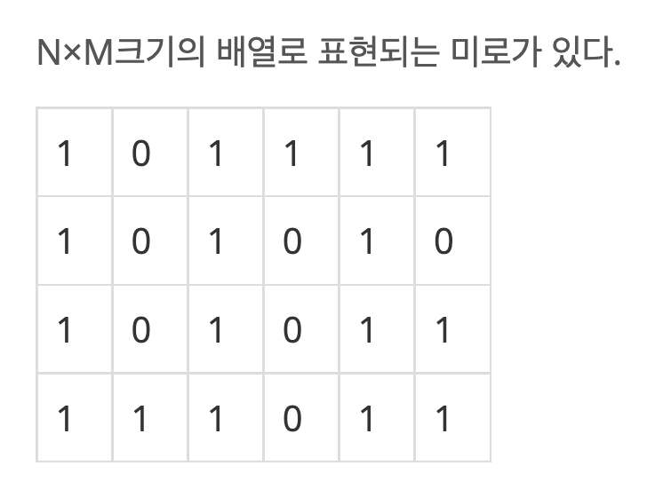
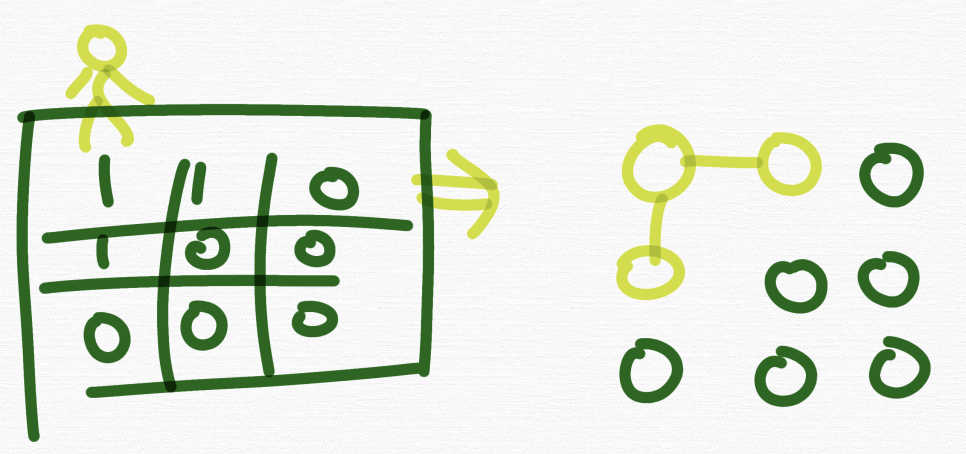
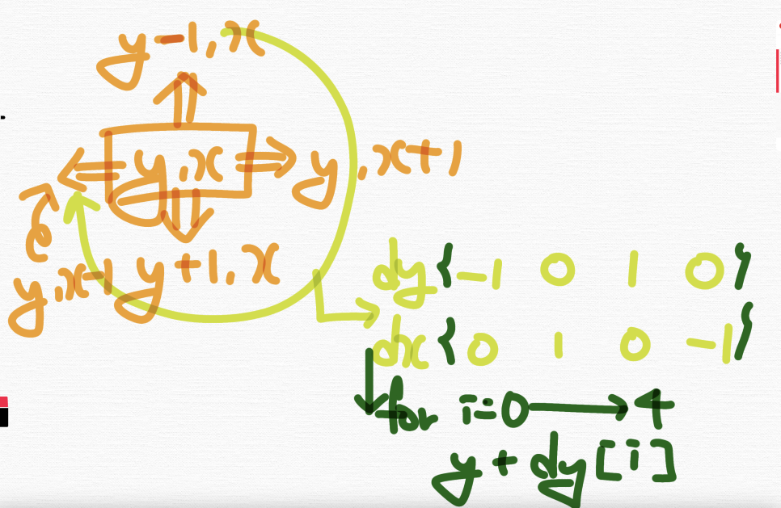

# 맵과 방향벡터(direction vector)

코딩인터뷰나 알고리즘 문제를 보면,
<br>
지금까지 배웠던 인접행렬이나 인접리스트로 문제가 주어지는 경우도 있지만 맵으로도 주어지는 경우가 있다. 

## 맵으로 주어지는 경우



이런 경우에 문제에서 **주어진 맵을 받아서 그 맵을 기준으로 탐색**을 해야한다. 

또한, 맵은 하나의 그래프이다. 예를 들어 3 * 3 맵이며 1은 갈 수 있는 지역, 0은 갈 수 없는 지역이며 4방향으로 탐색이 가능하다고 하면 다음과 같은 그래프가 되는 셈이다.



*주의사항 : 이 맵은 인접행렬이 절대 아니다*

*(참고)*
1. *정점으로 이해하기*
2. *상하좌우 탐색하기*
3. *재귀적으로 접근하기*

## 4방향탐색과 방향벡터

보통 이 맵을 기준으로 4가지 방향으로 탐색해나아가라고 한다. 4가지 방향은 보통 위, 아래, 오른쪽, 왼쪽으로 주어진다.(문제마다 다를 수는 있지만 일반적으로 그렇다.)

자,  어떠한 y, x가 주어졌을 때 y, x를 중심으로 상하좌우 4가지 방향으로 탐색은 어떻게 할까?

다음과 같이 위쪽부터 시계방향으로 탐색한다고 가정하면 -1, 0 / 0, 1 / 1, 0 / 0, -1 을 더해가며 탐색하게 된다.  



이를 배열로 나타내면 이런 방향벡터를 정의할 수 있고 이를 기반으로 탐색한다면 이러한 코드가 작성된다.  
<br>
*(참고) 보통 방향벡터는 dy, dx라는 이름으로 정의한다. direction_y, direction_x*

```c++
const int dy[] = {-1, 0, 1, 0};
const int dx[] = {0, 1, 0, -1};
for(int i = 0; i < 4; i++){
    ny = y + dy[i];
    nx = x + dx[i];
}
```

### 예시문제

Q1.  {0, 0}좌표에서 dy, dx를 만들어 4방향(위, 오른쪽, 아래, 왼쪽)을 탐색하며 좌표를 출력하시오.

```c++
#include <bits/stdc++.h>
using namespace std;

const int dy[] = {-1, 0, 1, 0};
const int dx[] = {0, 1, 0, -1};

int main(){
    int y = 0, x =0;

    for(int i = 0; i < 4; i++){
        int ny = y + dy[i];
        int nx = x + dx[i];
        cout << ny << " : " << nx << "\n";
    }

    return 0;
}
/*
-1 : 0
0 : 1
1 : 0
0 : -1 
*/
```

Q2.  {0, 0}좌표에서 dy, dx를 만들어 8방향(위, 오른쪽, 아래, 왼쪽 및 대각선방향포함)을 탐색하며 좌표를 출력하시오.

```c++
#include <bits/stdc++.h>
using namespace std;

const int dy[] = {-1, -1, 0, 1, 1, 1, 0, -1};
const int dx[] = {0, 1, 1, 1, 0, -1, -1, -1};

int main(){
    int y = 0, x =0;

    for(int i = 0; i < 8; i++){
        int ny = y + dy[i];
        int nx = x + dx[i];
        cout << ny << " : " << nx << "\n";
    }

    return 0;
}
/*
-1 : 0
-1 : 1
0 : 1
1 : 1
1 : 0
1 : -1
0 : -1
-1 : -1
*/
```

Q. 3 * 3 맵을 입력받아야 함. 이 맵은 1과 0으로 이루어져있고 {0, 0}은 무조건 1임을 보장한다. {0, 0}부터 4방향을 기준으로 한칸씩 탐색해나가며 방문한 정점은 다시 방문하지 않으며 방문하는 좌표를 출력하는 코드. 0은 갈 수 없는 지역. 1은 갈 수 있는 지역을 구현하시오

```c++
#include <bits/stdc++.h>
using namespace std;

const int n = 3;
int a[n][n], visited[n][n];
const int dy[] = {-1, 0, 1, 0};
const int dx[] = {0, 1, 0, -1};

void go(int y, int x){
    visited[y][x] = 1;
    cout << y << " : " << x << "\n";
    for(int i = 0; i < 4; i++){
        int ny = y + dy[i];
        int nx = x + dx[i];
        /* 오버플로, 언더플로 먼저 체크하기 */
        if(ny < 0 || ny >= n || nx < 0 || nx >= n) continue;
        if(a[ny][nx] == 0) continue;
        if(visited[ny][nx]) continue;
        go(ny, nx);
    }
}

int main(){
    for(int i = 0; i < n; i++){
        for(int j = 0; j < n; j++){
            cin >> a[i][j];
        }
    }

    go(0, 0);
    return 0;
}
/* 
1 0 1
1 0 1
0 1 1
*/
```