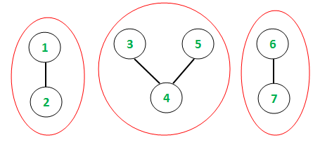
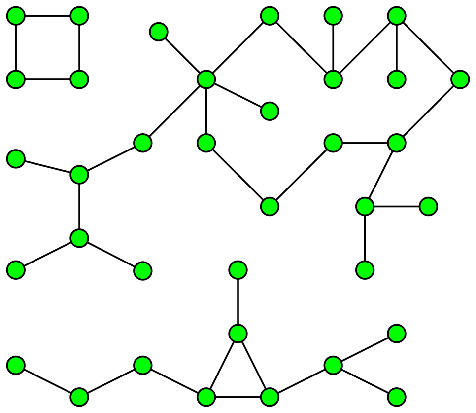

# 연결된 컴포넌트(connected component)

연결된 컴포넌트는 **연결된 하위그래프를 말하며 연결된 하나의 덩어리** 이다. 이 덩어리는 연결된 컴포넌트에 속한 **"모든 정점을 연결하는 경로가 있다."**라는 특징을 가진다.

위 그림에서 연결된 컴포넌트의 수는 총 3개이고 각각의 컴포넌트는 2개, 3개, 2개라는 정점을 가진다. 

위 그림에서 conneceted component는 3개가 된다. 

즉, **연결되어있는지 아니면 연결되어있지 않는지를 토대로 연결된 컴포넌트로 나눈다.** 이러한 컴포넌트들을 번호를 붙여가며 색칠하는 알고리즘은 **풀르드필(floodfill)**이라고 한다. 