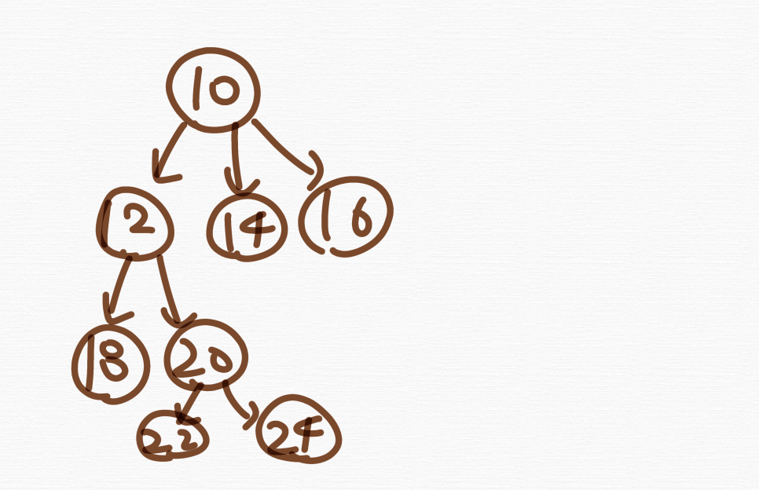
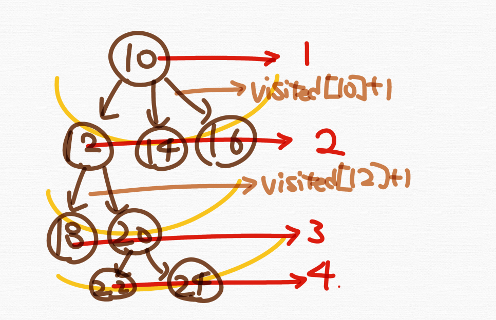
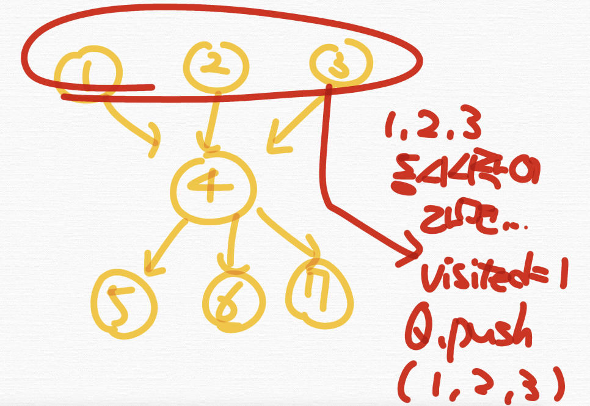
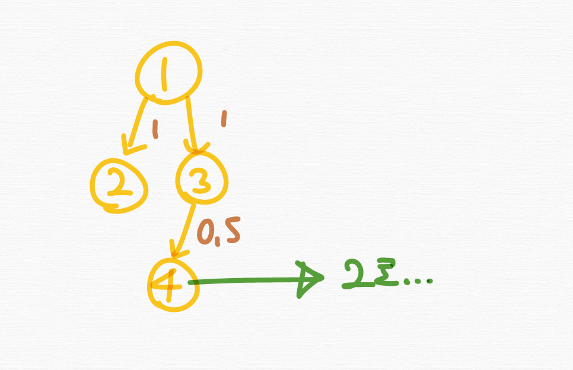

# 너비우선탐색(BFS, Breadth First Search)

BFS는 **그래프를 탐색하는 알고리즘**이며 **어떤 정점에서 시작해 다음 깊이의 정점으로 이동하기전 현재 깊이의 모든 정점을 탐색하며 방문한 정점은 다시 방문하지 않는 알고리즘**이다. 같은 가중치를 가진 그래프에서 최단거리알고리즘으로 쓰인다. 


BFS로 탐색을 한다는 것은 이런식으로 레이어별, 레벨별로 탐색한다는 뜻이다.

## DFS와 BFS의 비교


## 수도코드1

먼저 시작지점인 u를 "방문처리"를 하고 "큐(queue)에 푸시"를 한다. 그리고 q.size() 만큼 while 반복문을 돌면서 큐 앞단의 있는 u를 다시 끄집어내서 그 u를 중심으로 인접한 노드들을 탐색을 한다. 방문한 정점은 다시 방문하지 않고 방문처리를 하면서 큐(queue)에 푸시를 하며 방문처리를 한다. 

```c++
BFS(G, u)
    u.visited = true
    q.push(u);
    while(q.size()) 
        u = q.front() 
        q.pop()
        for each v ∈ G.Adj[u]
            if v.visited == false
                v.visited = true
                q.push(v) 
```

## ⭐️수도코드2

수도코드1은 방문처리만을 하는 코드이다. 하지만 보통 문제에서 BFS를 쓸 때는 가**중치가 같은 그래프 내에서 최단거리 알고리즘으로 쓰인다.** 그러기 위해 **"최단거리 배열"** 을 방문하면서 만들어주어야 하는데 다음과 같은 수도코드를 사용한다. 

```c++
BFS(G, u)
    u.visited = 1
    q.push(u);
    while(q.size()) 
        u = q.front() 
        q.pop()
        for each v ∈ G.Adj[u]
            if v.visited == false
                v.visited = u.visited + 1
                q.push(v) 
```

## 구현코드 

이 그래프에서 화살표는 한칸이라는 의미를 가진다. 10번정점으로부터 24번 정점까지의 최단거리는 얼마일까? 
<br>
3칸이다. 
<br>
이를 BFS로 구현해보자. 



```c++
#include<bits/stdc++.h>
using namespace std;     
vector<int> adj[100];
int visited[100]; 
int nodeList[] = {10, 12, 14, 16, 18, 20, 22, 24};
void bfs(int here){
    queue<int> q; 
    visited[here] = 1; 
    q.push(here);
    while(q.size()){
        int here = q.front(); q.pop();
        for(int there : adj[here]){
            if(visited[there]) continue;
            visited[there] = visited[here] + 1;
            q.push(there);
        }
    }
}
int main(){
    adj[10].push_back(12);
    adj[10].push_back(14);
    adj[10].push_back(16);
    
    adj[12].push_back(18);
    adj[12].push_back(20);


    adj[20].push_back(22);
    adj[20].push_back(24);
    bfs(10);
    for(int i : nodeList){
        cout << i << " : " << visited[i] << '\n';
    }
    cout << "10번으로부터 24번까지 최단거리는 : " << visited[24] - 1 << '\n';
    return 0; 
} 
/*
10 : 1
12 : 2
14 : 2
16 : 2
18 : 3
20 : 3
22 : 4
24 : 4
10번으로부터 24번까지 최단거리는 : 3
*/
```
즉, 이런식으로 탐색하게 되며 자동적으로 최단거리가 구해지는 것이다.



### Q. 만약 앞의 그래프의 가중치가 한칸이 아니고 2칸이라면 어떻게 될까?

3 * 2를 하면 된다. 답은 6칸이다.

### Q. 시작지점이 다수라면? 

"시작지점이 다수" 라면 처음 큐에 푸시하는 지점도 다수가 되어야 하며 해당 지점들의 visited를 모두 1로 만들면서 시작해야 한다. 



```c++
void bfs(int here){
    ...
    for(int i = 1; i <=3; i++>){
        visited[here] = 1;
        q.push(here);
    }
}
```

### Q. BFS는 왜 가중치가 같은 그래프내에서만 최단거리 알고리즘으로 쓰이는가? 가중치가 다른 그래프에서는 안되는가?

다음과 같은 그래프가 있다고 하자. 3번에서 4번으로 가는 가중치가 0.5이며 그래프내의 가중치가 서로 다르게 된다. 이 때 1번부터 4번까지 가는 최단거리를 구한다고 했을 때 우리가 지금까지 배운 BFS로는 2밖에 출력이 안되게 된다. 그래서 못쓰는 것이다.



*(참고) 가중치가 다른 그래프 내에서 최단거리 알고리즘은 다익스트라, 벨만포드 등을 써야한다.*
​
## 예시문제

승원이는 당근을 좋아해서 당근마킷에 엔지니어로 취업했다. 당근을 매우좋아하기 때문에 차도 당근차를 샀다. 이 당근차는 한칸 움직일 때마다 당근을 내뿜으면서 간다. 즉, "한칸" 움직일 때 "당근한개"가 소모된다는 것이다. 승원이는 오늘도 아침 9시에 일어나 당근마킷으로 출근하고자 한다. 승원이는 최단거리로 당근마킷으로 향한다고 할 때 당근몇개를 소모해야 당근마킷에 갈 수 있는지 알아보자. 이 때 승원이는 육지로만 갈 수 있으며 바다로는 못간다. 맵의 1은 육지며 0은 바다를 가리킨다. 승원이는 상하좌우로만 갈 수 있다. 

**입력**

맵의 세로길이 N과 가로길이 M 이 주어지고 이어서 N * M의 맵이 주어진다. 그 다음 줄에 승원이의 위치(y, x)와 당근마킷의 위치(y, x)가 주어진다. 이 때 승원이의 시작위치(y, x)에서 "당근한개"가 이미 소모된 상태로 본다.

**출력**

당근을 몇개 소모해야 하는지 출력하라.

**범위**

1 <= N <= 100
1 <= M <= 100 

**예제입력**

```
5 5
0 0
4 4
1 0 1 0 1
1 1 1 0 1
0 0 1 1 1
0 0 1 1 1
0 0 1 1 1
```

**예제출력**

```
9
```

**정답**
```c++
#include <bits/stdc++.h>
using namespace std;

int n, m, sy, sx, ty, tx;
const int dy[] = {-1, 0, 1, 0};
const int dx[] = {0, 1, 0, -1};
int a[104][104], visited[104][104];

void dfs(int y, int x){
    queue<pair<int, int>> q;
    visited[y][x] = 1;
    q.push({y, x});

    while(q.size()){
        tie(y, x) = q.front(); 
        q.pop();
        for(int i = 0; i < 4; i++){
            int ny = y + dy[i];
            int nx = x + dx[i];
            if(ny < 0 || ny >= n || nx < 0 || nx >= m) continue;
            if(!a[ny][nx] || visited[ny][nx]) continue;
            visited[ny][nx] = visited[y][x] + 1;
            q.push({ny, nx});
        }
    }
}

int main(){

    cin >> n >> m;
    cin >> sy >> sx;
    cin >> ty >> tx;

    for(int i = 0; i < n; i++){
        for(int j = 0; j < m; j++){
            cin >> a[i][j];
        }
    }

    dfs(sy, sx);

    cout << visited[ty][tx];

}
```

*(tip) `visited[..] = 1;` 꼭 걸고 시작하기*
