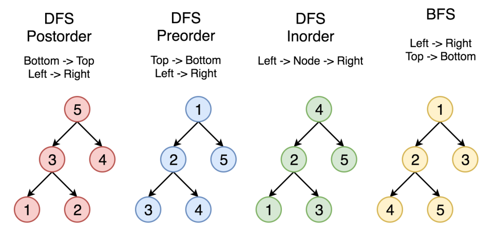

# 트리순회(Tree traversal)

트리 순회는 **트리 구조에서 각각의 노드를 정확히 한 번만, 체계적인 방법으로 방문하는 과정**을 말한다. 이는 노드를 방문하는 순서에 따라 *후위순회, 전위순회, 중위순회, 레벨순회*가 있다.  보통 설명할 때는 **이진트리를 기반**으로 설명하지만 **다른 모든 트리에서 일반화**를 시킬 수 있다.

## 후위순회(postorder traversal)

후위순회는 **자식들 노드를 방문하고 자신의 노드를 방문**하는 것을 말한다.
<br>
*post : ~이후의를 뜻하는 접두사*

### 수도코드

```
postorder( node )
    if (node.visited == false) 
        postorder( node->left ) 
        postorder( node->right )
        node.visited = true
```
방문한다? = visited 배열을 색칠하는 것을 생각해야한다.

## 전위순회(preorder traversal)

전위순회는 **먼저 자신의 노드를 방문하고 그 다음 노드들을 방문하는 것**을 말한다. (DFS를 생각하면 된다.)
<br>
*pre : ~이전의를 뜻하는 접두사*

### 수도코드

```
preorder( node )
    if (node.visited == false)
        node.visited = true
        preorder( node->left )
        preorder( node->right )
```

## 중위순회(inorder traversal)

중위순회는 **왼쪽 노드를 먼저 방문 그다음의 자신의 노드를 방문하고 그 다음 오른쪽 노드를 방문하는 것**을 말한다. 

"안에 넣다."

### 수도코드

```
inorder( node )
    if (node.visited == false) 
        inorder( node->left )
        node.visited = true
        inorder( node->right )
```

## 레벨순회(level traversal)

레벨순회는 앞서 설명한 BFS를 생각하면 된다.


## 구현코드

### Q. 아래의 그래프가 주어졌을 때 preorder, inorder, postorder를 구현하라. 

수도코드를 보고 코드를 구축하는 연습을 해야한다. 아래와 같이 그래프가 주어졌을 때 비어진 함수를 채워서 preorder, inorder, postorder를 구현하고 이 때 방문했을 때 해당 노드를 출력하는 것을 구현하라.

```c++
#include <bits/stdc++.h>
using namespace std; 
vector<int> adj[1004]; 
int visited[1004];

void postOrder(int here){  
} 
void preOrder(int here){ 
}  
void inOrder(int here){    

} 
int main(){
	adj[1].push_back(2);
	adj[1].push_back(3);
	adj[2].push_back(4);
	adj[2].push_back(5); 
	int root = 1;
    cout << "\n 트리순회 : postOrder \n";
    postOrder(root); memset(visited, 0, sizeof(visited));
    cout << "\n 트리순회 : preOrder \n"; 
    preOrder(root); memset(visited, 0, sizeof(visited)); 
    cout << "\n 트리순회 : inOrder \n"; 
    inOrder(root); 
    return 0;
} 
```

**정답**

```c++
#include <bits/stdc++.h>
using namespace std; 
vector<int> adj[1004]; 
int visited[1004];

void postOrder(int here){  
    if(visited[here] == 0){
        if(adj[here].size() == 1) postOrder(adj[here][0]);
        if(adj[here].size() == 2){
            postOrder(adj[here][0]);
            postOrder(adj[here][1]);
        }
        visited[here] = 1;
        cout << here << " ";
    }
} 
void preOrder(int here){ 
    if(visited[here] == 0){
        visited[here] = 1;
        cout << here << " ";
        if(adj[here].size() == 1) preOrder(adj[here][0]);
        if(adj[here].size() == 2){
            preOrder(adj[here][0]);
            preOrder(adj[here][1]);
        }
    }
}  
void inOrder(int here){    
    if(visited[here] == 0){
        if(adj[here].size() == 1){
            inOrder(adj[here][0]);
            visited[here] = 1;
            cout << here << " ";
        }else if(adj[here].size() == 2){
            inOrder(adj[here][0]);
            visited[here] = 1;
            cout << here << " ";
            inOrder(adj[here][1]);
        }else{
            visited[here] = 1;
            cout << here << " ";
        }
    }
} 
int main(){
	adj[1].push_back(2);
	adj[1].push_back(3);
	adj[2].push_back(4);
	adj[2].push_back(5); 
	int root = 1;
    cout << "\n 트리순회 : postOrder \n";
    postOrder(root); memset(visited, 0, sizeof(visited));
    cout << "\n 트리순회 : preOrder \n"; 
    preOrder(root); memset(visited, 0, sizeof(visited)); 
    cout << "\n 트리순회 : inOrder \n"; 
    inOrder(root); 
    return 0;
} 
```

## 정리

수도코드처럼 어떤 부분을 "방문처리를 할까?"를 생각하면 된다. 사실 여기서 visited배열은 쓰지 않아도 된다. 단방향 간선이기 때문이다.  다만, 수도코드에 있기 때문에 넣어서 구현했다.



postorder의 경우 4, 5, 2, 3, 1 이런식으로 방문되는 것을 볼 수 있다. 구현해보고 위그림과 비교하면서 공부하면 된다.


