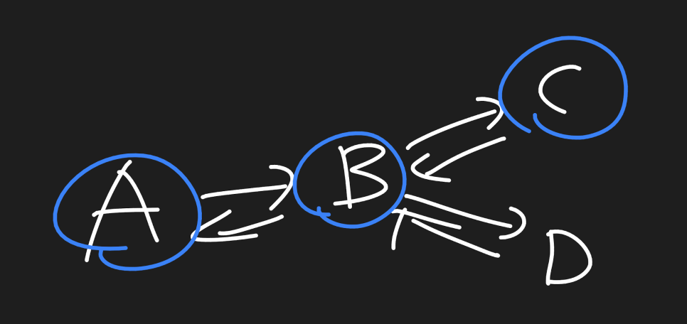
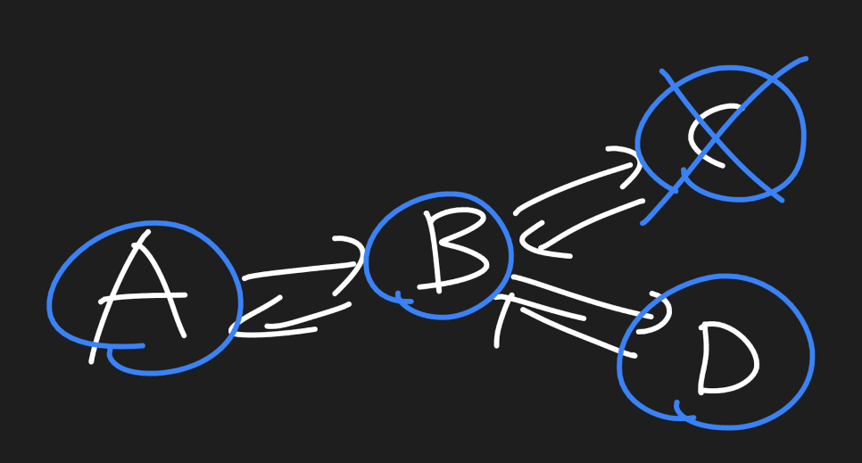

# 완탐과 원복

우리는 경우의 수를 모두 따지는 완탐을 하고 있다. 어떤 맵에서 어떤 것을 색칠하거나 뭘 세운다라고 했을 때 경**우의 수들끼리 서로의 상태값이 영향을 미치지 않게 하려는 방법이 바로 원복**이다. 

보통은 방문배열인 visited 를 통해 "색칠하고" "다시 지운다(원복)"를 통해 실행된다.

예시는 다음과 같다.

A -> B -> C 와 A -> B -> D의 경우의 수를 출력하는 문제이다.



자 방문 배열을 통해 A, B, C를 색칠한다. 

색칠한다는 것은 visited[A] = 1 따위가 되는 것이다.

자 그다음에 A -> B -> D라는 경우의 수를 뽑아낼 때 이다. 

C라는 상태가 색칠되어있지만, 해당 상태를 지워버린다. A - > B - >D라는 경우의 수를 뽑아낼 때 필요없는 경우의 수고 C는 D로 갈 때 영향을 미치면 안되는 경우의 수기 때문이다. 



코드로 나타내면 다음과 같다.

```c++
#include <bits/stdc++.h>
using namespace std;

int visited[4];
vector<int> adj[4];
vector<int> v;

void print(){
    for(int i : v) cout << char('A' + i) << " ";
    cout << "\n";
}

void go(int idx){
    if(v.size() == 3){
        print();
        return;
    }
    for(int there : adj[idx]){
        if(visited[there]) continue;
        visited[there] = 1;
        v.push_back(there);
        go(there);
        visited[there] = 0;
        v.pop_back();
    }
}

int main(){
    adj[0].push_back(1);
	adj[1].push_back(2);
	adj[1].push_back(3); 
	adj[1].push_back(0);
	adj[2].push_back(1);
	adj[3].push_back(1); 

    visited[0] = 1;
    v.push_back(0);
    go(0);

    return 0;
}
```

**출력**

```
A B C
A B D
```

## 문제 : 긍정왕 홍철이의 구걸 여행

홍철이는 3 * 3 맵에서 {0, 0} 지점에서 길을 잃어버렸다. 긍정왕 홍철이는 길을 잃어버린 김에 구걸을 하면서 돈을 모으면서 여행을 가려고 한다. 목적지는 {2, 2}이며 방문한 정점은 다시 방문할 수 없고 해당 맵에 구걸로 얻을 수 있는 돈들이 있다. 홍철이는 4방향(상하좌우)로 움직일 수 있다.  {2, 2}까지 간다고 했을 때 이 돈들을 모으는 모든 경우의 수를 출력하여라. 

```
맵 : 
{10, 20, 21}, 
{70, 90, 12},
{80, 110, 120} 
```

## 정답

```c++
#include <bits/stdc++.h>
using namespace  std;

const int n = 3;
int a[3][3] = {
{10, 20, 21}, 
{70, 90, 12},
{80, 110, 120} 
};
int visited[3][3];
const int dy[] = {-1, 0, 1, 0};
const int dx[] = {0, 1, 0, -1};
vector<int> v; 

void print(){
    for(int i : v) cout << i << " ";
	cout << '\n';
}

void go(int y, int x){
    if(y == n - 1 && x == n - 1){
        print();
        return;
    }
    for(int i = 0; i < 4; i++){
        int ny = y + dy[i];
        int nx = x + dx[i];
        if(ny < 0 || nx < 0 || ny >= 3 || ny >= 3) continue;
        if(visited[ny][nx]) continue;
        visited[ny][nx] = 1;
        v.push_back(a[ny][nx]);
        go(ny, nx);
        visited[ny][nx] = 0;
        v.pop_back();
    }
}

int main(){

    visited[0][0] = 1;
    v.push_back(a[0][0]);
    go(0, 0);
    return 0;
}
```

**출력**

```
10 20 21 12 120
10 20 21 12 90 110 120
10 20 21 12 90 70 80 110 120
10 20 90 12 120
10 20 90 110 120
10 20 90 70 80 110 120
10 70 90 20 21 12 120
10 70 90 12 120
10 70 90 110 120
10 70 80 110 90 20 21 12 120
10 70 80 110 90 12 120
10 70 80 110 120
```

