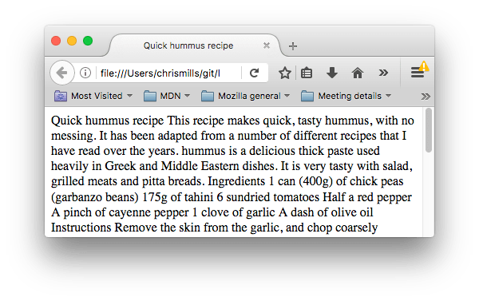

## HTML 텍스트 기본

HTML의 주요 작업 중 하나는 **브라우저가 텍스트를 올바르게 표시 할 수 있도록 텍스트 구조와 의미 (시멘틱(semantics)라고도 함)를 제공하는 것이다.** 이번 글에서는 HTML을 사용하여 제목 및 단락을 추가하고, 단어를 강조하고, 목록을 만드는 등의 방법으로 텍스트 페이지를 구성하는 방법을 설명한다.

### 기본적인 것: 제목과 단락

- 각 단락은 `<p>` 요소 안에 둘러싸여 있어야 한다.
- 각 제목도 heading 요소 안에 둘려싸여 있어야 한다.


#### 구조화된 계층을 구현하기

```html
<h1>The Crushing Bore</h1>

<p>By Chris Mills</p>

<h2>Chapter 1: The dark night</h2>

<p>
  It was a dark night. Somewhere, an owl hooted. The rain lashed down on the ...
</p>

<h2>Chapter 2: The eternal silence</h2>

<p>
  Our protagonist could not so much as a whisper out of the shadowy figure ...
</p>

<h3>The specter speaks</h3>

<p>
  Several more hours had passed, when all of a sudden the specter sat bolt
  upright and exclaimed, "Please have mercy on my soul!"
</p>
```

구조화된 계층이 타당해 보이는 한 연관된 요소들이 정확히 무엇을 나타내는지는 당신에게 달려있다.

다음을 주의하자.

- **가급적이면 페이지 당 하나의 `<h1>` 만 사용해야 한다.** `<h1>`은 최상위에 있는 표제이며 나머지 다른 표제들은 계층적으로 이것 밑에 위치한다.
- **각 표제들을 계층적으로 올바른 순서로 사용해야 한다.**`<h3>`을 하위 표제로 사용하고 그 다음 `<h2>`를 하위 표제의 하위로 사용하지 말아야 한다. 이해하기 어려울 뿐더러 이상한 결과를 야기할 수 있다.
- 6개의 Heading을 사용할 수 있지만 꼭 필요한 것이 아니라면 **한 페이지에 3개 이상을 사용하지 않도록 해야한다.** 많은 목차 레벨을 가진 문서(예를 들어 너무 깊은 heading 계층)는 *다루기 힘들고 탐색하기 어렵다.* 이러한 상황에서는 가능하다면 컨텐츠를 여러 페이지로 나누는 것이 바람직하다.

#### 왜 우리는 구조가 필요할까?

```html
<body>
    Quick hummus recipe

    This recipe makes quick, tasty hummus, with no messing. It has been adapted from a number of different recipes that I have read over the years.

    Hummus is a delicious thick paste used heavily in Greek and Middle Eastern dishes. It is very tasty with salad, grilled meats and pitta breads.

    Ingredients

    1 can (400g) of chick peas (garbanzo beans)
    175g of tahini
    6 sundried tomatoes
    Half a red pepper
    A pinch of cayenne pepper
    1 clove of garlic
    A dash of olive oil

    Instructions

    Remove the skin from the garlic, and chop coarsely
    Remove all the seeds and stalk from the pepper, and chop coarsely
    Add all the ingredients into a food processor
    Process all the ingredients into a paste.
    If you want a coarse "chunky" hummus, process it for a short time
    If you want a smooth hummus, process it for a longer time

    For a different flavour, you could try blending in a small measure of lemon and coriander, chili pepper, lime and chipotle, harissa and mint, or spinach and feta cheese. Experiment and see what works for you.

    Storage

    Refrigerate the finished hummus in a sealed container. You should be able to use it for about a week after you've made it. If it starts to become fizzy, you should definitely discard it.

    Hummus is suitable for freezing; you should thaw it and use it within a couple of months.


</body>
```

  

**이는 컨텐츠에 구조를 입히는 요소가 없기 때문에 브라우저는 무엇이 heading이고 무엇이 문단인지 알 수 없어 텍스트가 한 덩어리로 뭉쳐있는 것이다.**

- 웹 페이지를 보는 유저는 필요한 컨텐츠를 빠르게 훑어보는 경향이 있고 종종 heading만 읽기도 한다. *(우리는 보통 웹 페이지에서 매우 짧은 시간을 보낸다.)* 몇 초 안에 필요한 어떤 것도 찾지 못하면 사용자는 다른 곳으로 갈 수도 있다.

- **검색 엔진들은 당신의 페이지 내 heading을 페이지 검색 순위에 영향을 주는 중요한 키워드로 고려해 indexing 한다.** heading이 없다면, 당신의 페이지는 검색 엔진 최적화(SEO)에 관해서는 형편없게 된다.

- 시각 장애인들은 자주 웹페이지를 읽지 못한다. 대신 그들은 듣는다. 이는 *screen reader* 라고 불리는 소프트웨어를 사용해 이뤄진다. 이 소프트웨어는 텍스트 컨텐츠에 더 빠르게 접근할 수 있는 방안을 제공한다. 사용된 다양한 기술 중 하나로, 그들은 *heading을 읽어줌으로서 문서의 개요를 제공하며 그들의 사용자들이 필요로 하는 정보를 빠르게 찾을 수 있도록 한다.* heading이 없었더라면 그들은 어쩔 수 없이 문서 전체를 읽어야 했을 것이다.

- 컨텐츠를 CSS로 꾸미거나, JavaScript로 흥미로운 일을 하게 하기 위해서, 당신은 관련 컨텐츠를 감싸는 요소가 필요하다. 그렇게 하면 *CSS/JavaScript는 효과적으로 그에 적용될 수 있다.*

그러므로 우리는 컨텐츠를 구조적인 markup에 적용시켜야 한다.

#### 우리는 왜 Semantic을 필요로 할까?

Semantic(직역 : 의미를 담은, 의미론적인)은 우리 주변 어디에서나 사용된다. *우리는 과거의 경험으로부터 일상적인 대상의 기능이 무엇인지 구분한다.* 우리가 어떤 것을 보면 그것의 기능은 무엇일지 알 수 있다. 그래서, 예를 들어, 우리가 빨간 신호등을 '멈춤'으로, 초록 신호등을 '출발'로 인식한다. 잘못된 semantic들이 적용될 경우 상황은 복잡해진다. 

비슷한 맥락에서, **우리는 정확한 요소를 사용하고 있는지, 우리의 컨텐츠에 정확한 의미, 기능, 모습을 담았는지 확실히 해야 한다.** 이 맥락에서 `<h1>` 요소 또한 텍스트에 "내 페이지 최상위 heading"의 역할로 감싸는 semantic 요소이다.

기본적으로, 브라우저는 이에 큰 사이즈의 폰트를 적용해 heading처럼 보이게 할 것이다. (비록 당신이 CSS를 사용해 원하는 어떤 모습으로도 스타일 할 수 있지만 말입니다.) 더 중요하게, **이것의 의미론적인 가치는 다양한 방식으로 사용될 것이다.** 예를 들어 검색 엔진이나 screen reader에서 사용되는 것 처럼 말이다. (위에서 서술한 것처럼.)

반면에, 당신은 어떤 요소도 최상위 heading처럼 보이게 할 수 있다.

```html
<span style="font-size: 32px; margin: 21px 0;"
  >Is this a top level heading?</span
>
```

이것은 `<span>` 요소로 의미가 없다. 당신은 컨텐츠에 추가적인 의미를 더하지 않고 CSS 를 적용하고 싶을 때 (혹은 JavaScript를 적용해 무언가를 하고 싶을 때) 이것을 사용한다. 우리는 이것에 CSS를 더해 최상위 heading처럼 보이게 했지만, *이것이 semantic(의미론적인) 가치는 없기 때문에*, 위에서 서술된 추가적인 이득들은 얻지 못할 것이다. 작업에 관계있는 HTML 요소를 사용하는 것이 좋은 생각이다.


### Lists

#### Unordered (순서 없음)

정렬되지 않은 목록은 항목의 *순서가 중요하지 않은 항목 목록을 표시하는 데 사용*된다.

```html
<ul>
  <li>milk</li>
  <li>eggs</li>
  <li>bread</li>
  <li>hummus</li>
</ul>
```

#### Ordered (순서 있음)

순서 있는 리스트는 *항목의 순서가 중요한 목록*이다.

```html
<ol>
  <li>Drive to the end of the road</li>
  <li>Turn right</li>
  <li>Go straight across the first two roundabouts</li>
  <li>Turn left at the third roundabout</li>
  <li>The school is on your right, 300 meters up the road</li>
</ol>
```


#### 리스트 내부의 리스트(Nesting lists)

```html
<ol>
  <li>Remove the skin from the garlic, and chop coarsely.</li>
  <li>Remove all the seeds and stalk from the pepper, and chop coarsely.</li>
  <li>Add all the ingredients into a food processor.</li>
  <li>
    Process all the ingredients into a paste.
    <ul>
      <li>
        If you want a coarse "chunky" hummus, process it for a short time.
      </li>
      <li>If you want a smooth hummus, process it for a longer time.</li>
    </ul>
  </li>
</ol>
```

### 중요(Emphasis)와 강조(Strong importance)

#### 중요(Emphasis)

`<em>` (emphasis) 요소는 문서를 더 흥미롭게 읽게 될 뿐만 아니라, 화면판독기에 인식되면 다른 톤의 목소리로 표현된다. 브라우저에서는 기본적으로 *이탤릭체로 스타일을 지정하지만, 단지 이탤릭체로 스타일링하기 위해 이 태그를 사용하는 것은 지양한다.* 스타일링을 위해서는 `<span>` 요소에 약간의 CSS를 더하거나 `<i>`요소를 사용할 수 있다.

```html
<p>I am <em>glad</em> you weren't <em>late</em>.</p>
```

#### 강조(Strong importance)

`<strong>` (strong importance)요소는 문서를 더 유용하게 만드는 것뿐만 아니라, 화면판독기에 인식되면 다른 톤의 목소리로 표현된다. 브라우저에서는 기본적으로 *굵은 텍스트로 스타일을 지정하지만, 단지 굵게 스타일링하기 위해 이 태그를 사용하는 것은 지양한다.* 스타일링을 위해서는 `<span>` 요소에 약간의 CSS를 더하거나 `<b>` 요소를 사용할 수 있다.

```html
<p>This liquid is <strong>highly toxic</strong>.</p>

<p>I am counting on you. <strong>Do not</strong> be late!</p>
```

#### Italic, bold, underline

`<b>`, `<i>`, `<u>`요소들은 CSS가 형편없이 지원되거나 완전히 지원되지 않는 경우에 표현할 수 있도록 고안되었다. *의미론적이 아닌 표현에만 영향을 주는 이와 같은 요소들은 현재적 요소로 알려져 있으며, 더 이상 사용되어서는 안된다.* 앞에서 살펴본 바와 같이 의미론은 접근성, SEO 등에 매우 중요하기 때문이다.

HTML5 에서는 `<b>`, `<i>`,` <u>` 를 조금 혼란스럽긴 하지만 새로운 의미론적 역할로 재정립하였다.

**가장 좋은 경험법칙**: 적합한 요소가 더 없다면, 과거로부터 줄곧 굵거나 이탤릭체를 쓰거나 밑줄을 치는 방법으로 표현했던 의미를 전달하기 위해 `<b>`, `<i>`, `<u>`를 사용하는 것이 적절할 것 같다. 그러나 늘 접근성에 관해 염두하는 것은 항상 중요하다. 이탤릭체의 개념은 스크린리더를 사용하는 사람이나 라틴 문자체계 이외의 사용자에게는 별로 도움이 되지 않는다.

- `<i>` 요소는 과거로부터 줄곧 기울임꼴로 전달되는 의미를 전달하기 위해 사용된다. 외래어, 분류학 명칭, 전문 용어, 생각...

- `<b>` 요소는 과거로부터 줄곧 굵은 글씨로 전달되는 의미를 전달할 때 사용한다. 주요 단어, 제품 이름, 주요 문장...

- `<u>` 요소는 과거로부터 줄곧 밑줄을 치는 것으로 전달되는 의미를 전달할 떄 사용한다. 적절한 이름, 잘못된 철자...

> [!NOTE]  
> **참고**: 밑줄에 대한 위험성 중 하나: **사람들은 밑줄을 하이퍼링크와 강하게 연관시킨다.** *따라서 웹에서는 링크에만 밑줄을 긋는 것이 가장 좋다.* 의미론적으로 적합한 경우 `<u>` 요소를 사용하되, CSS를 사용하여 기본 밑줄을 웹에서 더 적합하게 변경할 수 있는지 고려한다. 그것이 어떻게 이루어질 수 있는지는 아래의 예에서 확인할 수 있다.

```html
<!-- scientific names -->
<p>
  The Ruby-throated Hummingbird (<i>Archilochus colubris</i>) is the most common
  hummingbird in Eastern North America.
</p>

<!-- foreign words -->
<p>
  The menu was a sea of exotic words like <i lang="uk-latn">vatrushka</i>,
  <i lang="id">nasi goreng</i> and <i lang="fr">soupe à l'oignon</i>.
</p>

<!-- a known misspelling -->
<p>Someday I'll learn how to <u>spel</u> better.</p>

<!-- Highlight keywords in a set of instructions -->
<ol>
  <li><b>Slice</b> two pieces of bread off the loaf.</li>
  <li>
    <b>Insert</b> a tomato slice and a leaf of lettuce between the slices of
    bread.
  </li>
</ol>
```