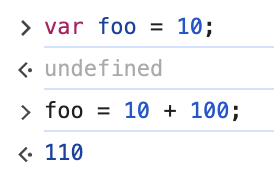

# 05. 표현식과 문

## 5.1 값

값(value)은 **식(표현식, expression)이 평가(evaluate)되어 생성된 결과**를 말한다.

## 5.2 리터럴

리터럴(literal)은 **사람이 이해할 수 있는 문자 또는 약속된 기호를 사용해 값을 생성하는 표기법(notation)** 을 말한다.

```javascript
// 숫자 리터럴 3
3
```

단순한 숫자 3이 아닌 숫자 리터럴이다. 사람이 이해할 수 있는 아라비아 숫자를 사용해 숫자 리터럴 3을 코드에 기술하면 *자바스크립트 엔진은 이를 평가해 숫자 값 3을 생성한다.*

자바스크립트 엔진은 코드가 실행되는 시점인 **런타임에 리터럴을 평가해 값을 생성**한다. 즉, 리터럴은 값을 생성하기 위해 미리 약속한 표기법이라고 할 수 있다.

### 리터럴 종류

- 정수 리터럴 
- 부동소수점 리터럴
- 2 / 8 / 16 진수 릴터럴
- 문자열 리터럴
- 불리언 리터럴
- null 리터럴
- undefined 리터럴
- 객체 리터럴
- 배열 리터럴
- 함수 리터럴
- 정규 표현식 리터럴

## 5.3 표현식

표현식(expression)은 **값으로 평가될 수 있는 문(statement)** 이다. 즉, **표현식이 평가되면 새로운 값을 생성하거나 기존 값을 참조한다.**

앞서 살펴본 리터럴은 값으로 평가된다. 따라서 리터럴도 표현식이다.

이처럼 표현식은 *리터럴, 식별자(변수, 함수 등의 이름), 연산자, 함수 호출* 등의 조합으로 이뤄질 수 있다. 다음과 같이 다양한 표현식이 있지만 값으로 평가된다는 점에서 모두 동일하다. 즉, **값으로 평가될 수 있는 문은 모두 표현식**이다.

```javascript
// 리터럴 표현식
10
'HELLO'

// 식별자 표현식(선언이 이미 존재한다고 가정)
sum
peson.name
a[1]

// 연산자 표현식
10 + 20 
sum = 10
sum !== 10

// 함수/메서드 호출 표현식(선언이 이미 존재한다고 가정)
square()
person.getName()
```

표현식과 표현식이 평가된 값은 동등한 관계, 즉 동치(equivalent)이다.

```javascript
var x = 1 + 2;

// 식별자 표현식 x는 3으로 평가된다.
x + 3; // 6
```

이처럼 표현식은 다른 표현식의 일부가 되어 새로운 값을 만들어낼 수 있다.

## 5.4 문

문(statement)은 **프로그램을 구성하는 기본 단위이자 최소 실행 단위**이다. 문의 집합으로 이뤄진 것이 바로 프로그램이며, 문을 작성하고 순서에 맞게 나열하는 것이 프로그래밍이다.

문은 여러 토큰으로 구성된다. **토큰(token)이란 문법적인 의미를 가지며, 문법적으로 더 이상 나눌 수 없는 코드의 기본 요소를 의미한다.**
<br>
ex) 키워드, 식별자, 연산자, 리터럴, 세미콜론, 마침표 등..

문을 명령문이라고도 부른다. 즉, 문은 컴퓨터에 내리는 명령이다.

문은 선언문, 할당문, 조건문, 반복문 등으로 구분할 수 있다.

## 5.5 세미콜론과 세미콜론 자동 삽입 기능

세미콜론(;)은 **문의 종료를 나타낸다.** 이때 0개 이상의 문을 중괄호로 묶은 코드 블록({...}) 뒤에는 세미콜론을 붙이지 않는다.
<br>
ex) if문, for문, 함수 ...
<br>
이러한 코드 블록은 언제나 문의 종료를 의미하는 *자체 종결성(self closing)* 을 갖기 때문이다.

문의 끝에 붙이는 세미콜론은 옵션이다. *즉, 세미콜론은 생략 가능하다.* 자바스크립트 엔진이 소스코드를 해석할 때 문의 끝이라고 예측되는 지점에 세미콜론을 자동으로 붙여주는 **세미콜론 자동 삽입 기능(ASI, automatic semicolon insertion)** 이 암묵적으로 수행되기 때문이다.

그러나 세미콜론 [사용을 권장하는 분위기](https://twitter.com/littledan/status/951523844262637568)이므로 세미콜론을 붙이자.

## 5.6 표현식인 문과 표현식이 아닌 문

**표현식인 문은 값으로 평가될 수 있는 문이며, 표현식이 아닌 문은 값으로 평가될 수 없는 문**을 말한다.

**표현식인 문과 표현식이 아닌 문을 구별하는 가장 간단하고 명료한 방법은 변수에 할당해 보는 것이다.**

```javascript
// 표현식이 아닌 문은 값처럼 사용할 수 없다.
var foo = var x; // SyntacError : Unexpected token var

// 변수 선언문은 표현식이 아닌 문이다.
var x;

// 할당문은 그 자체가 표현식이지만 완전한 문이이기도 하다. 즉, 할당문은 표현식인 문이다.
x = 100;

// 표현식인 문은 값처럼 사용할 수 있다.
var foo = x = 100;
```

> [!NOTE]
> **완료 값(completion value)**<br>
    크롬 개발자 도구에서 표현식이 아닌 문을 실행하면 언제나 undefined를 출력한다. 이를 완료 값이라 한다. 완료 값은 표현식의 평가 결과가 아니다. 따라서 다른 값과 같이 변수에 할당할 수 없고 참조할 수 없다.


