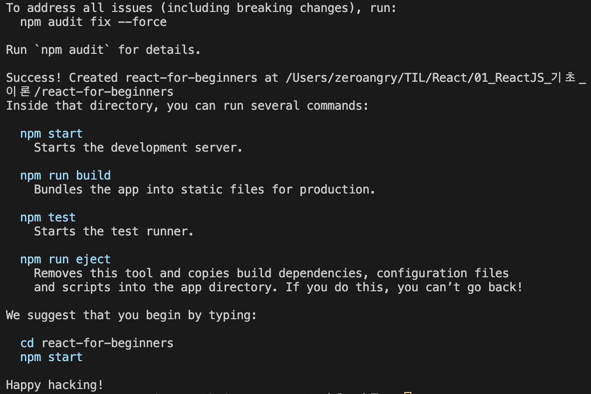
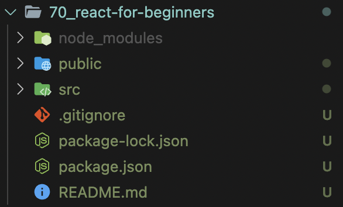
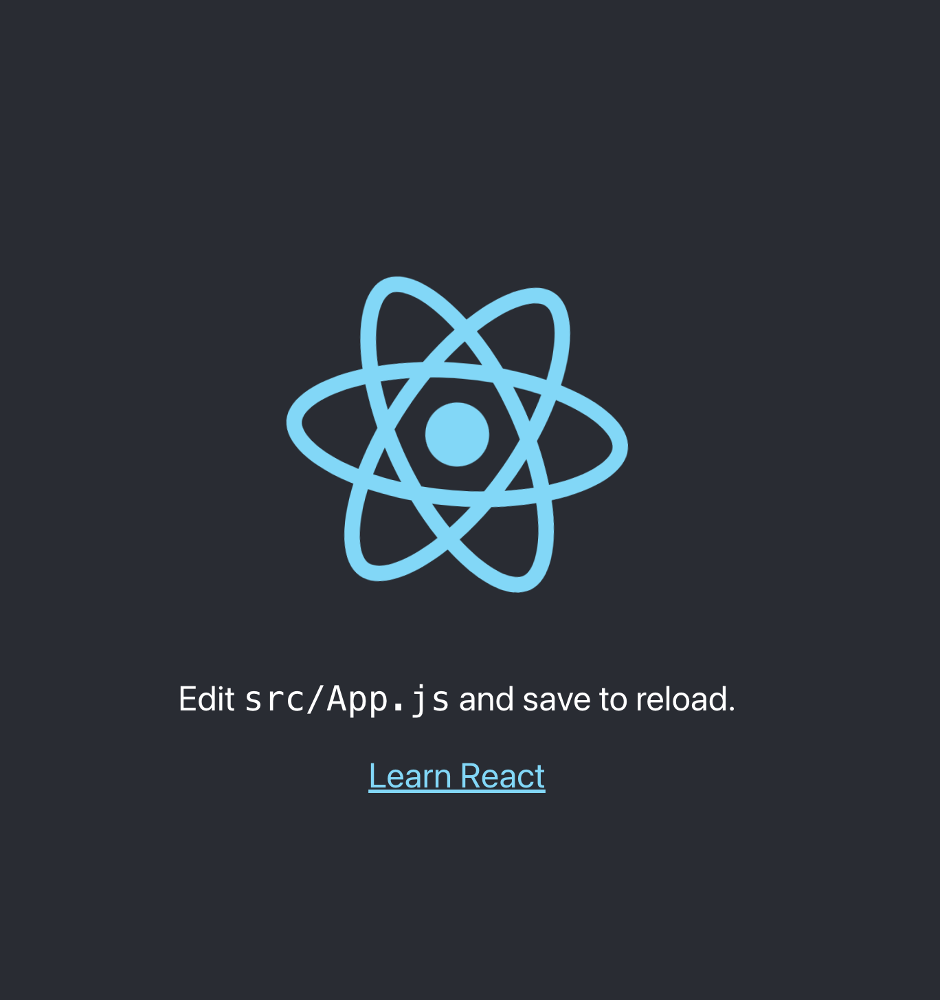
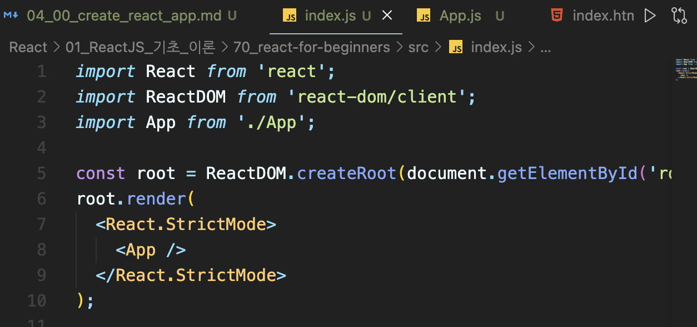
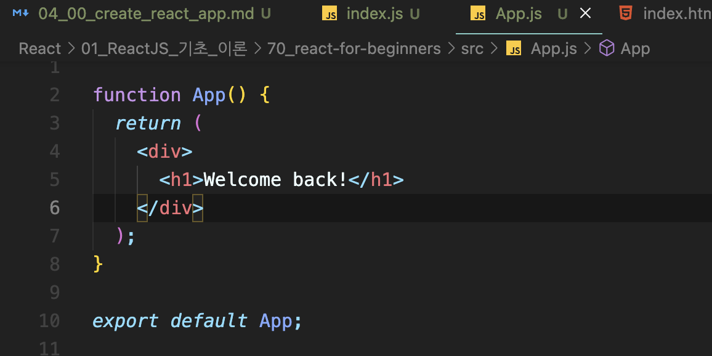
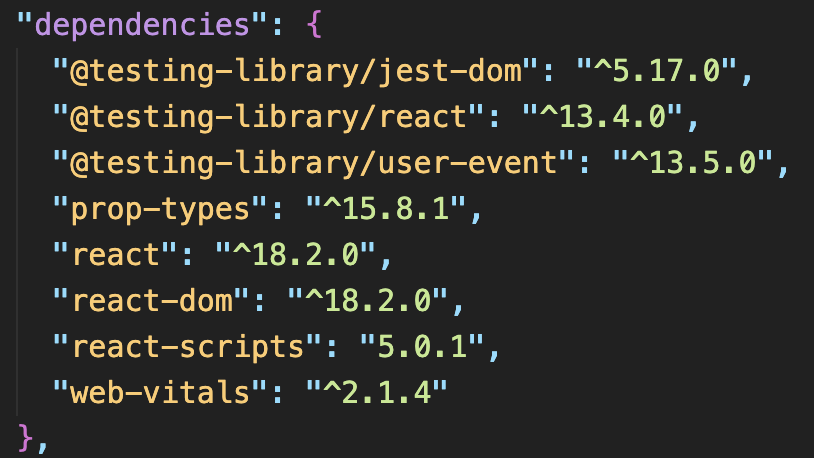

# Create React App

## create react app 란?
create react app은 리액트 애플리케이션을 만드는 최고의 방식이다. 

이전에 우리가 만든 리액트 애플리케이션은 스크립트를 import함으로써 만들어졌다. 그리고 기본적으로 우리가 모든 걸 해야 했다.

그러나 create react app을 사용한다면, React JS 어플리케이션을 만듦에 있어 훨씬 쉬어질 것이다.

왜냐하면 create react app은 엄청나게 많은 스크립트들과 많은 사전 설정들을 사용자들을 위해서 준비해주기 때문이다.

예를 들어, create react app을 사용하면, 개발 서버에 접근한다든가, 자동으로 새로고침을 시켜준다든가, 즉각적으로 어플리케이션 안에 css를 포함시켜 준다든가 하는 기능들이 있다.

## create react app 초기설정

1. [node.js](https://nodejs.org/en)를 설치한다.
    1. `node -v`
    2. `npx`
2. 프로젝트 생성을 원하는 디렉토리로 이동 
3. `npx create-react-app react
-for-beginners` 실행 




4. 생성한 프로젝트 디렉토리로 이동
<br>(참고) src 폴더는 **나의 모든 파일들을 넣을 폴더**이다.
5. `npm start` 실행



6. src에서 App.js와 index.js 제외하고 다 삭제하기
7. App.js 와 index.js 기본 상태로 만들어 놓기




## Tour of CRA 

여기서 create react app을 직접 사용해보면 개발 환경이 훨씬낫다는 것을 느낄 수 있다.

### prop-types 사용방법

```zhs
npm i prop-types
```

npm을 통해 install 해주면, package.json 에서 확인할 수 있다.



### 컴포넌트 만들기

컴포넌트를 생성해서 각각 원하는 곳에 해당 코드를 적용시킬 수 있다.

ex. Button.js / App.module.css


